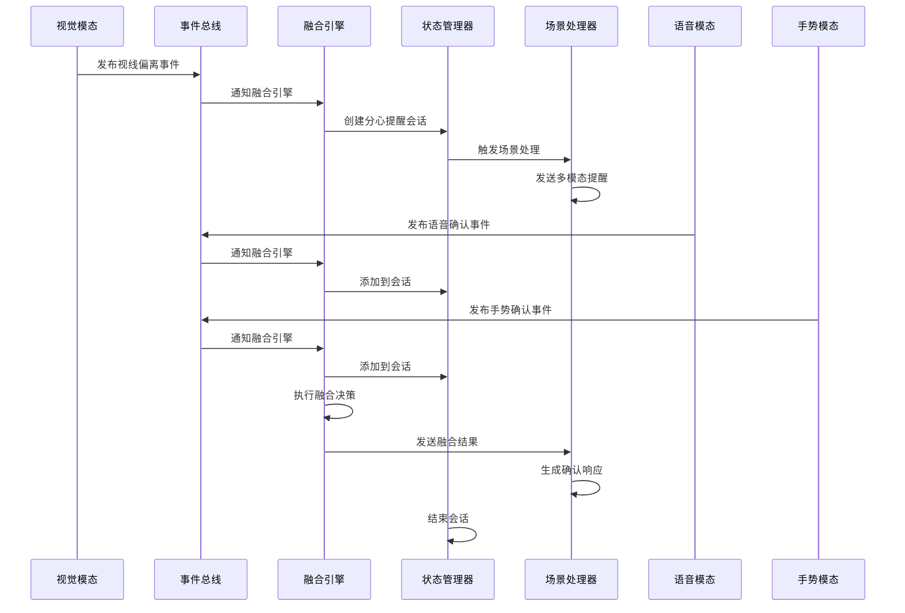
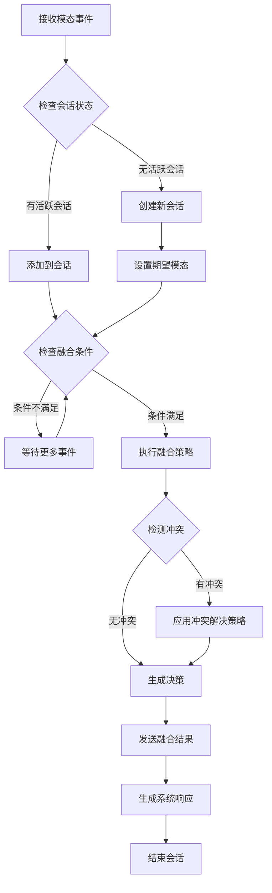

# 多模态融合系统架构设计

## 1. 系统概述

本系统实现了一个完整的车载多模态交互系统，支持语音、视觉、手势三种模态的协同工作。系统采用事件驱动架构，通过统一的事件总线实现模态间的数据融合和决策。

### 1.1 核心特性

- **多模态协同**：语音、视觉、手势三种模态协同工作
- **智能融合**：支持多种融合策略（置信度加权、优先级、多数投票）
- **冲突解决**：处理模态间的矛盾信号
- **实时响应**：低延迟的事件处理和决策
- **容错机制**：超时处理和异常恢复

### 1.2 典型应用场景

**分心提醒场景**：
1. 视觉模态检测到驾驶员视线偏离
2. 系统发出多模态提醒（语音+视觉）
3. 等待用户通过语音("已注意道路")或手势(竖拇指)确认
4. 融合多模态响应，确认注意力恢复

## 2. 系统架构

### 2.1 整体架构图

```
┌─────────────────────────────────────────────────────────────┐
│                    多模态融合系统                              │
├─────────────────────────────────────────────────────────────┤
│  应用层 (Application Layer)                                  │
│  ┌─────────────────┐  ┌─────────────────┐                   │
│  │  主应用程序      │  │  测试/演示程序   │                   │
│  └─────────────────┘  └─────────────────┘                   │
├─────────────────────────────────────────────────────────────┤
│  融合层 (Fusion Layer)                                       │
│  ┌─────────────────┐  ┌─────────────────┐  ┌──────────────┐ │
│  │  场景处理器      │  │  融合决策引擎    │  │  状态管理器   │ │
│  └─────────────────┘  └─────────────────┘  └──────────────┘ │
├─────────────────────────────────────────────────────────────┤
│  事件层 (Event Layer)                                        │
│  ┌─────────────────────────────────────────────────────────┐ │
│  │                事件总线 (Event Bus)                      │ │
│  └─────────────────────────────────────────────────────────┘ │
├─────────────────────────────────────────────────────────────┤
│  模态层 (Modality Layer)                                     │
│  ┌─────────────────┐  ┌─────────────────┐  ┌──────────────┐ │
│  │    语音模态      │  │    视觉模态      │  │   手势模态    │ │
│  │  ┌───────────┐  │  │  ┌───────────┐  │  │ ┌──────────┐ │ │
│  │  │语音识别   │  │  │  │眼动追踪   │  │  │ │手势识别  │ │ │
│  │  │意图分类   │  │  │  │头部姿态   │  │  │ │          │ │ │
│  │  └───────────┘  │  │  └───────────┘  │  │ └──────────┘ │ │
│  └─────────────────┘  └─────────────────┘  └──────────────┘ │
├─────────────────────────────────────────────────────────────┤
│  硬件层 (Hardware Layer)                                     │
│  ┌─────────────────┐  ┌─────────────────┐                   │
│  │      麦克风      │  │      摄像头      │                   │
│  └─────────────────┘  └─────────────────┘                   │
└─────────────────────────────────────────────────────────────┘
```

### 2.2 核心组件

#### 2.2.1 事件系统 (Event System)

**功能**：统一的多模态事件处理机制

**组件**：
- `EventBus`：事件总线，负责事件的发布和订阅
- `ModalityEvent`：多模态事件基类
- `AudioEvent`、`VisionEvent`、`GestureEvent`：具体模态事件

**设计模式**：观察者模式

```python
# 事件发布示例
gaze_event = VisionEvent(
    event_type=EventType.GAZE_CHANGED,
    data={"state": "left"},
    confidence=0.9
)
event_bus.publish(gaze_event)
```

#### 2.2.2 状态管理器 (State Manager)

**功能**：管理系统状态和交互会话

**核心状态**：
- `IDLE`：空闲状态
- `MONITORING`：监控状态
- `DISTRACTION_DETECTED`：检测到分心
- `WAITING_RESPONSE`：等待用户响应
- `PROCESSING_RESPONSE`：处理用户响应
- `INTERACTION_COMPLETE`：交互完成

**会话管理**：
- 创建和管理交互会话
- 跟踪期望的模态响应
- 处理会话超时

#### 2.2.3 融合决策引擎 (Fusion Engine)

**功能**：多模态数据融合和决策

**融合策略**：

1. **置信度加权 (Confidence Weighted)**
   ```
   决策分数 = Σ(模态权重 × 置信度 × 意图分数)
   ```

2. **优先级策略 (Priority Based)**
   ```
   按预定义优先级顺序选择第一个有效响应
   优先级：语音 > 手势 > 视觉
   ```

3. **多数投票 (Majority Vote)**
   ```
   选择获得最多模态支持的意图
   ```

**冲突解决策略**：
- `HIGHEST_CONFIDENCE`：选择置信度最高的
- `MODALITY_PRIORITY`：按模态优先级
- `TEMPORAL_ORDER`：按时间顺序
- `USER_PREFERENCE`：用户偏好

#### 2.2.4 场景处理器 (Scenario Handler)

**功能**：管理具体的交互场景和系统响应

**支持场景**：
- 分心提醒场景
- 语音命令场景
- 手势控制场景

**响应类型**：
- 文本响应
- 语音响应
- 视觉响应
- 触觉响应

## 3. 数据流程

### 3.1 分心提醒场景流程



### 3.2 融合决策流程



## 4. 融合算法详解

### 4.1 置信度加权融合

**算法描述**：
```python
def confidence_weighted_fusion(events, weights):
    weighted_scores = {}
    total_weight = 0
    
    for event in events:
        modality = event.modality
        weight = weights.get(modality, 1.0)
        confidence = event.confidence
        intent = extract_intent(event)
        
        if intent not in weighted_scores:
            weighted_scores[intent] = 0
        
        weighted_scores[intent] += weight * confidence
        total_weight += weight
    
    # 归一化
    for intent in weighted_scores:
        weighted_scores[intent] /= total_weight
    
    return max(weighted_scores, key=weighted_scores.get)
```

**适用场景**：语音命令场景，需要综合考虑各模态的可靠性

### 4.2 优先级融合

**算法描述**：
```python
def priority_based_fusion(events, priority_order):
    priority_events = group_by_modality(events)
    
    for modality in priority_order:
        if modality in priority_events:
            best_event = max(priority_events[modality], 
                           key=lambda e: e.confidence)
            intent = extract_intent(best_event)
            if intent:
                return intent, best_event.confidence
    
    return None, 0.0
```

**适用场景**：分心提醒场景，语音确认优先级高于手势

### 4.3 多数投票融合

**算法描述**：
```python
def majority_vote_fusion(events):
    intent_votes = {}
    
    for event in events:
        intent = extract_intent(event)
        if intent:
            if intent not in intent_votes:
                intent_votes[intent] = []
            intent_votes[intent].append(event)
    
    if not intent_votes:
        return None, 0.0
    
    best_intent = max(intent_votes, key=lambda i: len(intent_votes[i]))
    confidence = len(intent_votes[best_intent]) / len(events)
    
    return best_intent, confidence
```

**适用场景**：手势控制场景，需要多个模态的一致性确认

## 5. 冲突解决机制

### 5.1 冲突类型

1. **意图冲突**：不同模态表达不同意图
   - 语音说"确认"，手势做"拒绝"
   
2. **置信度冲突**：高置信度的相互矛盾信号
   - 高置信度的语音"拒绝" vs 高置信度的手势"确认"

3. **时序冲突**：时间上的不一致
   - 先说"确认"后做"拒绝"手势

### 5.2 解决策略

#### 5.2.1 模态优先级策略

```python
MODALITY_PRIORITY = {
    InteractionScenario.DISTRACTION_ALERT: [
        ModalityType.AUDIO,     # 语音优先
        ModalityType.GESTURE,   # 手势次之
        ModalityType.GAZE       # 视觉最后
    ]
}
```

**原理**：在车载环境中，语音交互比手势更自然和安全

#### 5.2.2 置信度阈值策略

```python
def resolve_by_confidence(conflicting_events, threshold=0.8):
    high_confidence_events = [
        e for e in conflicting_events 
        if e.confidence >= threshold
    ]
    
    if len(high_confidence_events) == 1:
        return high_confidence_events[0]
    
    # 如果多个高置信度事件冲突，使用其他策略
    return resolve_by_priority(high_confidence_events)
```

#### 5.2.3 时间窗口策略

```python
def resolve_by_temporal_order(events, recent_window=2.0):
    current_time = time.time()
    recent_events = [
        e for e in events 
        if current_time - e.timestamp <= recent_window
    ]
    
    # 优先考虑最近的事件
    return max(recent_events, key=lambda e: e.timestamp)
```

## 6. 性能优化

### 6.1 事件处理优化

- **异步处理**：事件发布和处理采用异步机制
- **批量处理**：在时间窗口内批量处理相关事件
- **缓存机制**：缓存频繁访问的融合规则

### 6.2 内存管理

- **事件历史限制**：限制事件历史记录数量（1000条）
- **会话清理**：自动清理过期会话
- **日志轮转**：定期清理融合日志

### 6.3 实时性保证

- **优先级队列**：高优先级事件优先处理
- **超时机制**：防止会话无限等待
- **快速失败**：异常情况下快速返回默认决策

## 7. 扩展性设计

### 7.1 新模态接入

系统支持轻松接入新的模态：

```python
# 添加新的模态类型
class ModalityType(Enum):
    AUDIO = "audio"
    VISION = "vision"
    GESTURE = "gesture"
    HAPTIC = "haptic"  # 新增触觉模态

# 创建新的事件类型
class HapticEvent(ModalityEvent):
    def __init__(self, event_type, data, confidence=1.0):
        super().__init__(
            event_type=event_type,
            modality=ModalityType.HAPTIC,
            timestamp=time.time(),
            confidence=confidence,
            data=data
        )
```

### 7.2 新融合策略

```python
class FusionStrategy(Enum):
    MAJORITY_VOTE = "majority_vote"
    CONFIDENCE_WEIGHTED = "confidence_weighted"
    PRIORITY_BASED = "priority_based"
    NEURAL_NETWORK = "neural_network"  # 新增神经网络策略
```

### 7.3 新场景支持

```python
class InteractionScenario(Enum):
    DISTRACTION_ALERT = "distraction_alert"
    VOICE_COMMAND = "voice_command"
    GESTURE_CONTROL = "gesture_control"
    EMERGENCY_DETECTION = "emergency_detection"  # 新增紧急情况检测
```

## 8. 测试和验证

### 8.1 单元测试

- 事件系统测试
- 状态管理测试
- 融合算法测试
- 冲突解决测试

### 8.2 集成测试

- 端到端场景测试
- 性能压力测试
- 并发处理测试

### 8.3 用户测试

- 真实驾驶场景测试
- 用户体验评估
- 系统可靠性验证

## 9. 部署和运维

### 9.1 系统要求

- **硬件**：摄像头、麦克风、计算单元
- **软件**：Python 3.8+, OpenCV, MediaPipe
- **性能**：实时处理能力，低延迟响应

### 9.2 监控指标

- 事件处理延迟
- 融合决策准确率
- 系统资源使用率
- 用户交互成功率

### 9.3 故障处理

- 模态失效降级
- 网络断连恢复
- 异常情况记录

## 10. 总结

本多模态融合系统实现了语音、视觉、手势三种模态的协同工作，通过统一的事件驱动架构和智能的融合决策机制，为车载环境提供了自然、安全、可靠的人机交互体验。

系统的核心优势：

1. **模块化设计**：各组件职责清晰，易于维护和扩展
2. **智能融合**：多种融合策略适应不同场景需求
3. **冲突处理**：完善的冲突解决机制保证决策可靠性
4. **实时响应**：低延迟的事件处理满足实时交互需求
5. **容错机制**：超时处理和异常恢复保证系统稳定性

该系统为车载多模态交互提供了完整的解决方案，具有良好的实用性和扩展性。 